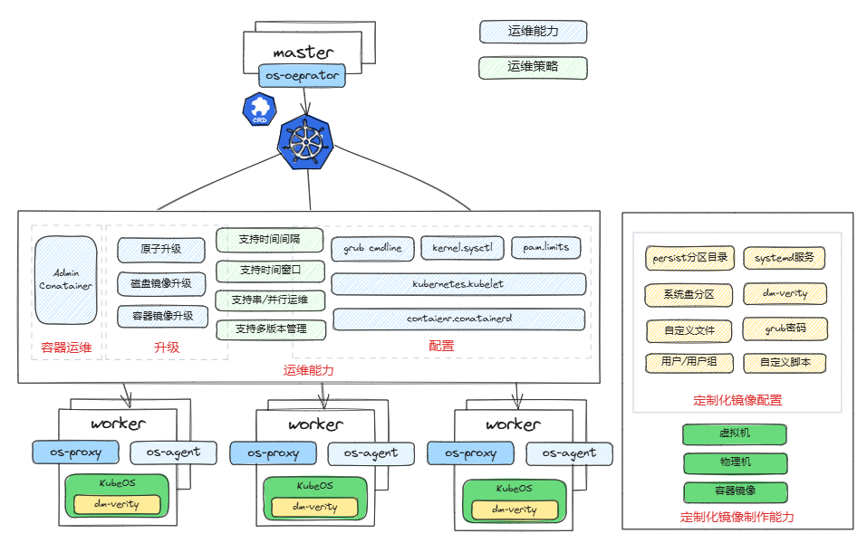

# KubeOS

在云计算场景中，容器和 Kubernetes 的应用日益广泛。然而，当前容器和操作系统（OS）独立管理的方式常常面临功能冗余，以及两套调度系统难以协同的问题。此外，OS 的版本管理也存在诸多挑战：相同版本的 OS 在使用过程中会因安装、更新或删除不同的软件包而逐渐产生差异，导致版本分裂。同时，OS 与业务紧耦合，造成大版本升级难度较高，进一步增加了运维复杂性。

**KubeOS** 是专为以容器形式运行业务的场景设计的一种轻量级操作系统。通过 Kubernetes 的 CRD（自定义资源定义）与 Operator 扩展机制，KubeOS 将 OS 作为 Kubernetes 的一个组件接入，使 OS 和业务处于同等地位。用户可通过 Kubernetes 集群统一管理节点上的容器和节点的 OS，从而实现一套系统同时管理容器与 OS。

KubeOS 的组件利用 Kubernetes Operator 扩展机制来控制容器 OS 的升级流程，支持对 KubeOS 的整体原子化升级。这种升级方式在升级前会将业务迁移到未升级的节点上，从而最大程度减少升级和配置过程对业务的影响。同时，通过原子化升级保持 OS 始终与预期状态同步，确保集群内 OS 的版本一致性，有效避免版本分裂问题。



以下链接可协助您使用KubeOS:

* [KubeOS组件构建指南](docs/quick-start.md)涵盖了从编译、制作和部署KubeOS组件的全流程。
* [镜像制作指导](docs/user_guide/KubeOS镜像制作指导-binary.md)包含了KubeOS镜像制作工具的详细使用方法。
* [KubeOS架构](docs/design/architecture.md)展示了其文件系统的设计理念及核心组件的详细信息。
* [用户指南](https://docs.openeuler.org/zh/docs/24.03_LTS/docs/KubeOS/overview.html)链接至openEuler容器OS文档。

## 特性介绍

### 升级

与传统的包管理器逐一升级软件包不同，KubeOS 在升级时会通过预制的完整根分区文件系统镜像实现全量升级。升级流程包括从 HTTP 服务器或容器镜像仓库下载升级镜像，并将新的根分区文件系统覆盖到备用的 root 分区。随后，节点从备用 root 分区启动，完成操作系统的全量升级。

此外，KubeOS 支持一键回滚至上一版本的操作系统。通过切换至备用分区启动，快速恢复节点的 OS 状态。

* **os-operator**: 部署在 Master 节点的 OS 自定义资源控制器，负责管理集群内所有节点 OS 的升级、回滚以及配置请求的下发。
* **os-proxy**: 部署在每个节点上的 OS 控制器，将针对该节点的升级、回滚和配置请求转发至 os-agent。
* **os-agent**: 部署在每个节点 OS 的 systemd 服务，负责执行具体的升级、回滚和配置任务。

更多详细信息，可见[升级指导](docs/quick-start.md#升级指导)。

### 配置

KubeOS 通过 Kubernetes 下发 OS 自定义资源，实现对集群内所有容器 OS 的统一配置管理。目前支持以下配置类型：

* 内核参数（临时/持久化）
* 内核启动参数
* pam_limits
* KubeletConfiguration
* containerd

更多详细信息，可见[配置指导](docs/quick-start.md#配置（Settings）指导)

### Admin运维容器

为了保持系统的轻量化，KubeOS 可不安装 SSH 服务（sshd）。在必要情况下，管理员可以通过部署 Admin 容器到目标节点，SSH 登录到容器内，再切换到节点主机命名空间，完成运维操作。

Admin 容器内可以安装丰富的调试工具，从而在主机命名空间下调用容器内的命令完成调试和检测任务。

更多详细信息，可见[Admin容器镜像制作部署和使用](docs/quick-start.md#admin容器镜像制作部署和使用)。

### dm-verity静态完整性保护

KubeOS当前基于[dm-verity](https://www.kernel.org/doc/html/latest/admin-guide/device-mapper/verity.html)+安全启动实现对rootfs的完整性保护，安全启动用于保护roothash完整性。

更多详细信息，可见[dm-verity介绍](docs/user_guide/dm-verity.md)。

### 镜像制作

KubeOS 支持制作多种类型的镜像，包括：

* 普通虚拟机镜像
* PXE 物理机镜像
* 升级容器镜像
* 启用 dm-verity 特性的虚拟机镜像

目前支持 x86 和 aarch64 架构，默认使用UEFI引导模式，部分支持 legacy 引导模式。

您可以通过以下命令创建 KubeOS 镜像：

```bash
make rust-agent
cargo run --package kbimg -- create -f KubeOS-Rust/kbimg/kbimg.toml 
```

更多详细信息，可见[镜像制作指导](docs/user_guide/KubeOS镜像制作指导-binary.md)

## Roadmap

### 即将到来

* **2025**:
  * [ ] Pod热迁移：提供用户无感、业务中断时间短的Pod热迁移解决方案

### 当前进展

* **2024**:
  * [x] 灵活、多维度的运维策略：分组分批次升级，基于时间窗升级的升级策略
  * [x] KubeOS 镜像定制化制作：支持用户根据需求制作定制化镜像
  * [x] 更强安全能力：支持安全启动和dm-verity
  * [x] 更丰富的配置管理：支持统一管理节点`containerd`和`kubelet`配置

* **2023**:
  * [x] 支持容器镜像(containerd)升级
  * [x] 新增settings配置功能
  * [x] 新增Admin容器功能
  * [x] 内存底噪优化：降低os-proxy和os-agent内存底噪80%

* **2022**:
  * [x] 支持物理机安装、升级
  * [x] 支持容器镜像(docker)升级

* **2021**:
  * [x] KubeOS发布
  * [x] 支持ARM架构

## How to Contribute

我们非常欢迎新贡献者加入到项目中来，也非常高兴能为新加入贡献者提供指导和帮助。您可以通过issue或者合入PR来贡献

## Licensing

KubeOS 使用 Mulan PSL v2.
