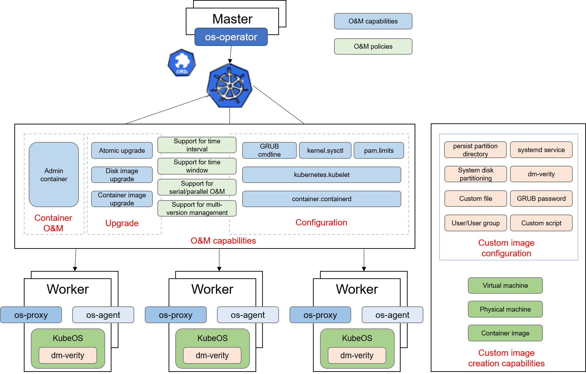

# KubeOS

In cloud computing scenarios, the use of containers and Kubernetes is becoming increasingly prevalent. However, the current approach of independently managing containers and operating systems (OSs) often leads to function redundancy and challenges in coordinating two separate scheduling systems. There are also many challenges in OS version management. Even for OSs of the same version, differences will gradually emerge over time due to the installation, update, or deletion of different software packages, leading to version split. Moreover, as the OS is tightly coupled with services, it is difficult to upgrade major versions, which further complicates O&M.

**KubeOS** is a lightweight OS designed for scenarios where services run in containers. By leveraging Kubernetes' custom resource definition (CRD) and Operator extension mechanism, KubeOS integrates the OS as a component of Kubernetes, placing the OS on an equal footing with services. You can use a Kubernetes cluster to centrally manage containers and OSs on nodes, enabling one system to manage both containers and OSs.

The components of KubeOS use the Kubernetes Operator extension mechanism to control the container OS upgrade process and support the overall atomic upgrade of KubeOS. In this upgrade mode, services are migrated to nodes that are not to be upgraded before an upgrade, minimizing the impact of the upgrade and configuration process on services. In addition, atomic upgrade ensures that the OS remains synchronized with the expected state, maintaining OS version consistency within the cluster and effectively preventing version split.



The following links can help you use KubeOS:

* [KubeOS component building guide](https://docs.openeuler.openatom.cn/en/docs/24.03_LTS_SP3/cloud/kubeos/kubeos/installation_and_deployment.html#installation-and-deployment) covers the entire process of compiling, creating, and deploying the KubeOS components.
* [Image creation guide](https://docs.openeuler.openatom.cn/en/docs/24.03_LTS_SP3/cloud/kubeos/kubeos/kubeos_image_creation.html#kubeos-image-creation) provides detailed instructions on how to use the KubeOS image creation tool.
* [KubeOS Architecture](https://atomgit.com/openeuler/KubeOS/blob/master/docs/design/architecture_en.md) provides the design concepts of the file system and details of core components.
* [User Guide](https://docs.openeuler.openatom.cn/en/docs/24.03_LTS_SP3/cloud/kubeos/kubeos/overview.html) links to the openEuler container OS documentation.

## Features

### Upgrade

Unlike conventional package managers that upgrade software packages one by one, KubeOS implements a full upgrade by using a preconfigured complete root partition file system image. The upgrade process includes downloading the upgrade image from the HTTP server or container image repository and writing the new root partition file system to the standby root partition. The node then boots from the standby root partition to complete the full upgrade of the OS.

KubeOS also supports one-click rollback to the previous OS version. By switching to the standby partition, the OS status of the node can be quickly restored.

* **os-operator**: OS custom resource controller deployed on the master node. It manages the upgrade, rollback, and configuration request delivery of the OSs on all nodes in the cluster.
* **os-proxy**: OS controller deployed on each node. It forwards the upgrade, rollback, and configuration requests of the node to os-agent.
* **os-agent**: systemd service deployed on the OS of each node. It executes specific upgrade, rollback, and configuration tasks.

For more information, see [upgrade guide](https://docs.openeuler.openatom.cn/en/docs/24.03_LTS_SP3/cloud/kubeos/kubeos/usage_instructions.html#upgrade).

### Configuration

KubeOS uses Kubernetes to deliver OS custom resources to centrally manage all container OSs in the cluster. Currently, the following configuration types are supported:

* Kernel parameters (temporary/persistent)
* Kernel boot parameters
* pam_limits
* KubeletConfiguration
* containerd

For more information, see [configuration guide](https://docs.openeuler.openatom.cn/en/docs/24.03_LTS_SP3/cloud/kubeos/kubeos/usage_instructions.html#settings).

### Admin O&M Container

To keep the system lightweight, the SSH service (sshd) does not need to be installed in KubeOS. If necessary, the administrator can deploy the Admin container on the target node, log in to the container using SSH, and switch to the host namespace of the node to perform O&M operations.

Various debugging tools can be installed in the Admin container to invoke commands in the container in the host namespace to complete debugging and detection tasks.

For more information, see [Creating, Deploying, and Using the Admin Container Image](docs/quick-start.md#admin容器镜像制作部署和使用).

### dm-verity Static Integrity Protection

KubeOS currently implements rootfs integrity protection based on [dm-verity](https://www.kernel.org/doc/html/latest/admin-guide/device-mapper/verity.html) and secure boot. Secure boot is used to protect the integrity of roothash.

For more information, see [dm-verity introduction](docs/user_guide/dm-verity.md).

### Image Creation

KubeOS supports the creation of multiple types of images, including:

* Common VM image
* PXE physical machine image
* Upgrade container image
* VM image with the dm-verity feature enabled

Currently, the x86 and AArch64 architectures are supported. The UEFI boot mode is used by default, and the legacy boot mode is partially supported.

You can run the following command to create a KubeOS image:

```bash
make rust-agent
cargo run --package kbimg -- create -f KubeOS-Rust/kbimg/kbimg.toml 
```

For more information, see [image creation guide](https://docs.openeuler.openatom.cn/en/docs/24.03_LTS_SP3/cloud/kubeos/kubeos/kubeos_image_creation.html#kubeos-image-creation).

## Roadmap

### Upcoming

* **2025**:
  * [ ] Pod live migration solution with no user awareness and short service interruption

### Current Progress

* **2024**:
  * [x] Flexible and multi-dimensional O&M policies: group- and batch-based upgrade, and time window–based upgrade
  * [x] Custom KubeOS image creation: on-demand creation of custom images by users
  * [x] Enhanced security capabilities: secure boot and dm-verity
  * [x] Enhanced configuration management: unified management of node `containerd` and `kubelet` configurations

* **2023**:
  * [x] Container image (containerd) upgrade
  * [x] Settings configuration
  * [x] Admin container
  * [x] Memory overhead reduction: os-proxy and os-agent memory overhead reduced by 80%

* **2022**:
  * [x] Physical machine installation and upgrade
  * [x] Container image (Docker) upgrade

* **2021**:
  * [x] KubeOS release
  * [x] Support for the ARM architecture

## How to Contribute

We welcome new contributors to join the project and are very pleased to provide guidance and help for new contributors. You can contribute by submitting issues or merging PRs.

## Licensing

KubeOS uses Mulan PSL v2.
