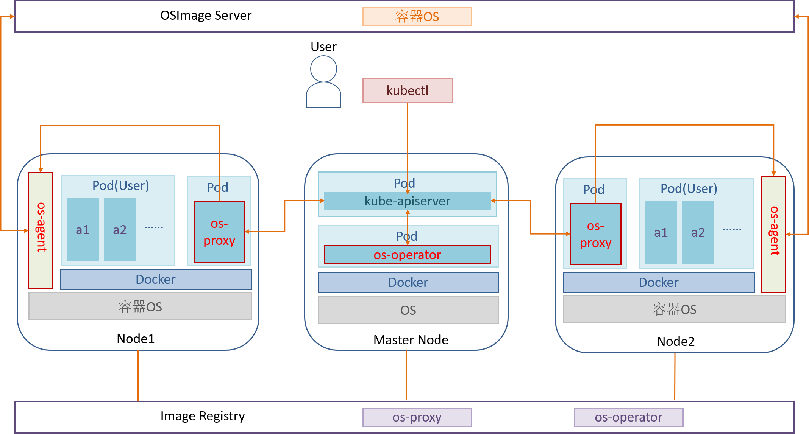
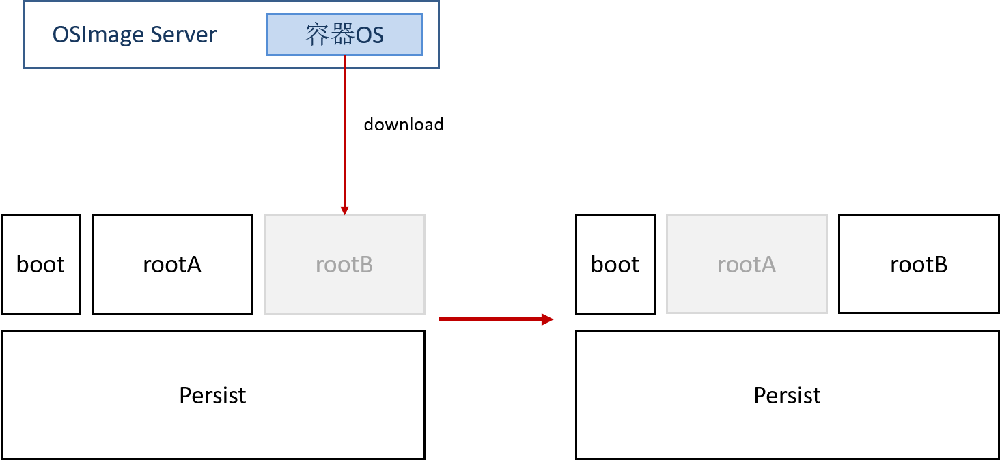

# KubeOS

## 概述

在云场景中，容器和 kubernetes 的应用越来越广泛。然而，当前对容器和 OS 进行独立管理的方式，往往面临功能冗余、两套调度系统协同困难的问题。另外，OS 的版本管理比较困难，相同版本的 OS 在使用过程中会各自安装、更新、删除软件包，一段时间后 OS 版本变得不一致，导致版本分裂，并且 OS 可能和业务紧耦合，造成大版本升级等比较困难。为了应对上述问题，openEuler 推出了基于openEuler 的容器操作系统 KubeOS 。

容器 OS 是针对业务以容器的形式运行的场景，专门设计的一种轻量级操作系统。基于 openEuler 的 KubeOS 将容器 OS 作为组件接入 kubernetes，使容器 OS 和业务处于同等地位，通过 kubernetes 集群统一管理容器和容器 OS，实现一套系统管理容器和 OS。

KubeOS 通过 kubernetes operator 扩展机制控制容器 OS 的升级流程，对容器 OS 进行整体升级，从而实现 OS 管理器和业务协同，该升级方式会在容器 OS 升级前，将业务迁移到其他非升级节点，减少 OS 升级、配置过程中对业务的影响。该升级方式是对容器 OS 进行原子升级，使 OS 一直向预想的状态同步，保证集群里的 OS 版本一致，避免版本分裂问题。

## 架构介绍

### KubeOS架构

**图1** KubeOS 架构 

如图所示，KubeOS 主要包含三个组件 os-operator，os-proxy 和 os-agent 。os-operator 和 os-proxy 运行在容器中，部署在 kubernetes 集群内；os-agent 不属于集群，直接作为进程运行在 Worker Node 中。

- os-operator：全局的容器 OS 管理器，持续查看所有节点的容器 OS 版本信息，并根据用户配置的信息控制同时进行升级的节点个数，并标记准备升级的节点。

- os-proxy：单节点的 OS 管理器，持续查看当前节点的容器 OS 版本信息。如果当前节点被 os-operator 标记为准备升级的节点后，锁定节点并驱逐 pod，转发升级信息到 os-agent 。

- os-agent：接收来自 proxy 的信息，从 OSImage Server 下载用于更新的容器 OS 镜像，然后进行升级并重启节点。

### KubeOS 文件系统

**图 2** KubeOS 文件系统布局

如图所示，KubeOS 包含四个分区：

- boot 分区：grub2 文件分区
- Persist 分区：用于存放持久性用户数据，容器 OS 升级时，该分区的数据也会保留
- 两个 root 分区：KubeOS 采用双分区模式，将 root 分区划分为 rootA 和 rootB。假定初始化时，系统运行在 rootA 分区上，当进行系统更新时，会下载新系统到 rootB 分区，grub 会有两个启动项分别为 A，B，将 grub 默认启动项设置为 B，最后会重启虚拟机。虚拟机启动后 KubeOS 将运行在刚更新过的 rootB 分区上。

KubeOS 的 root 文件系统为只读，用户的持久化数据存放在 Persist 持久化数据分区。