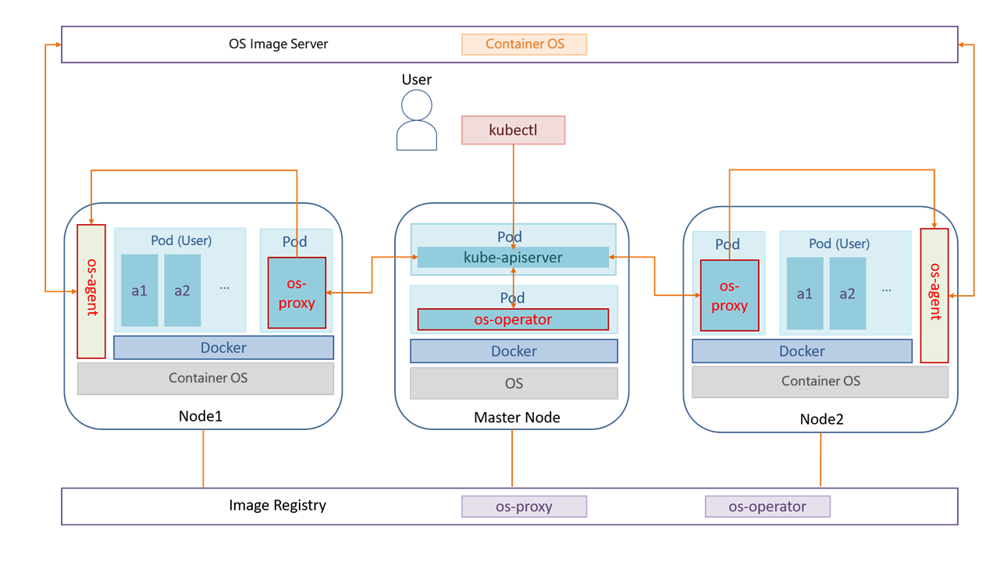
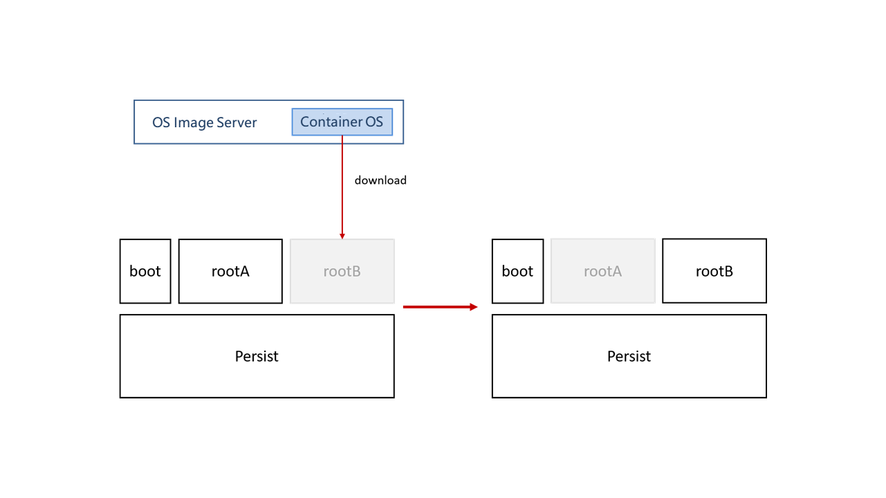

# About KubeOS

## Introduction

Containers and Kubernetes are widely used in cloud scenarios. However, a current manner of managing the containers and the OSs separately usually faces problems of function redundancy and difficult collaboration between scheduling systems. In addition, it is difficult to manage OS versions. Software packages are installed, updated, and deleted separately in OSs of the same version. After a period of time, the OS versions become inconsistent, causing version fragmentation. Besides, the OSs may be tightly coupled with services, making it difficult to upgrade major versions. To solve the preceding problems, openEuler provides KubeOS, a container OS upgrade tool based on openEuler.

Container OSs are lightweight OSs designed for scenarios where services run in containers. KubeOS connects container OSs as components to Kubernetes, so that the container OSs are in the same position as services. With KubeOS, a Kubernetes cluster manages containers and container OSs in a unified system.

KubeOS is a Kubernetes operator for controlling the container OS upgrade process and upgrading the container OSs as a whole to implement collaboration between the OS managers and services. Before the container OSs are upgraded, services are migrated to other nodes to reduce the impact on services during OS upgrade and configuration. In this upgrade pattern, the container OSs are upgraded atomically so that the OSs remain synchronized with the expected status. This ensures that the OS versions in the cluster are consistent, preventing version fragmentation.

## Architecture

### KubeOS Architecture

**Figure 1** KubeOS architecture

As shown in the preceding figure, KubeOS consists of three components: os-operator, os-proxy, and os-agent. The os-operator and os-proxy components run in containers and are deployed in the Kubernetes cluster. os-agent is not considered a cluster component. Its instances run on worker nodes as processes.

- os-operator: global container OS manager, which continuously checks the container OS versions of all nodes, controls the number of nodes to be upgraded concurrently based on the configured information, and marks the nodes to be upgraded.

- os-proxy: OS manager of a single node, which continuously checks the container OS version of the node. If a node is marked as the node to be upgraded by os-operator, the node is locked, the pod is evicted, and the upgrade information is forwarded to os-agent.

- os-agent: receives information from os-proxy, downloads the KubeOS image used for upgrade from the OS image server, upgrades the container OS, and restarts the node.

### File System of a Container OS

**Figure 2** File system layout of KubeOS

As shown in the figure,KubeOS comprises four partitions:

- boot partition: GRUB2 file partition.
- Persist partition: stores persistent user data. When the KubeOS is upgraded, the data in this partition is retained.
- Two root partitions: KubeOS use the dual-partition mode with two root partitions, rootA and rootB. Assume that the container runs the OS stored in the rootA partition after initialization. When the system is upgraded, the new system is downloaded to the rootB partition. GRUB has two boot options: A and B. The default boot option of GRUB is set to B and the node is restarted. After the node is started, the container runs the upgraded OS in the rootB partition.

The root file system of KubeOS is read-only. Users' persistent data is stored in the Persist partition.
